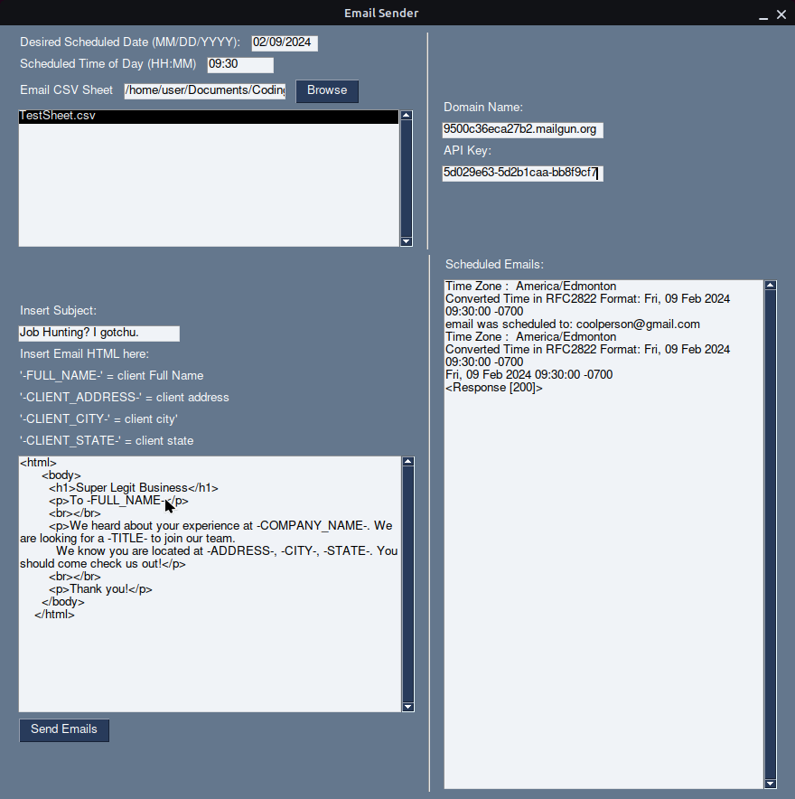
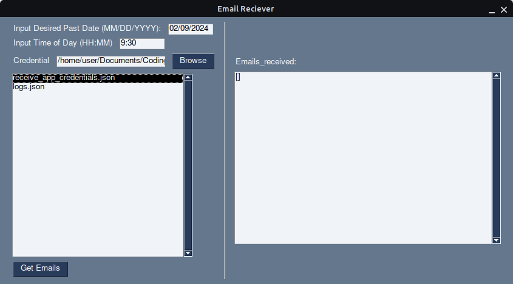

# Email Sender and Receiver with GUI

forked from an existing repository provided by Coding Minds

### Timezone Libraries

- get_timezone
- get_utc_offset
- get_rfc2822_time
- datetime

### MailGun API

- Get Mailgun API key : https://signup.mailgun.com/new/signup
- schedule_email
    - Tracking open email
        - The content of the email must be HTML component. Opens are tracked by including a transparent .png file, which
          will only work if there is an HTML component to the email (i.e., text only emails will not track opens)
- check_status
- References
    - https://documentation.mailgun.com/en/latest/user_manual.html#sending-via-api
    - https://documentation.mailgun.com/en/latest/user_manual.html#events
    - https://documentation.mailgun.com/en/latest/user_manual.html#tracking-opens

## Read Emails

### Gmail API

- A Google Cloud project.
- A Google account with Gmail enabled.
- References
    - https://developers.google.com/gmail/api/quickstart/python 

### PySimpleGUI Library

- https://www.pysimplegui.org/en/latest/

### EmailSender GUI

Don't freak out, that's not even 1/3 of the API key lol.

### EmailReeceiver GUI

